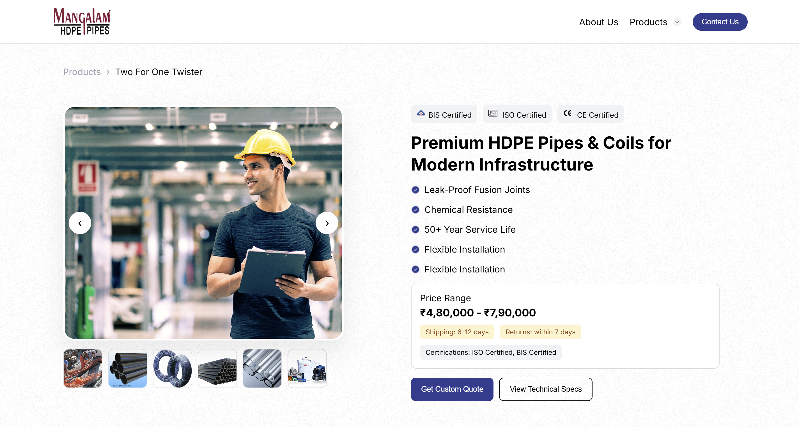
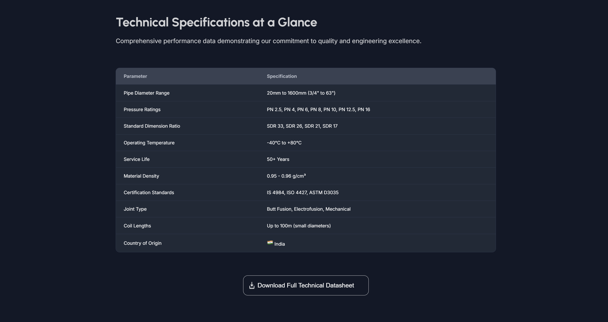
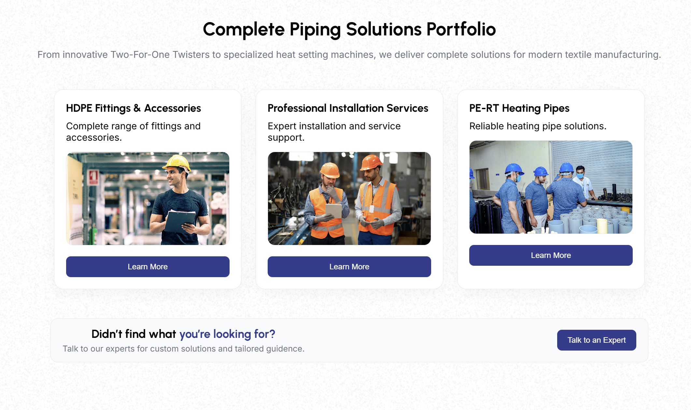

# Mangalam Pipes Project 🚀


A modern, responsive product website built using **HTML, CSS, and JavaScript**, showcasing HDPE pipe manufacturing, product details, and interactive UI components.

---

## 📌 Project Overview

This project represents a professional industrial website for **Mangalam Pipes**, focusing on:

* Product showcase
* Manufacturing process visualization
* Interactive UI elements
* Responsive design across devices

---

## ✨ Features

### 🔹 UI & Design

* Clean and modern layout
* Fully responsive (Mobile, Tablet, Desktop)
* Smooth scrolling experience
* Background overlay design

### 🔹 Interactive Components

* Hero image slider with auto-slide
* Process section with dynamic content switching
* Tab-based navigation system
* FAQ accordion functionality
* Application card slider
* Popup forms (Enquiry / Download)

### 🔹 Functionalities

* Dynamic content update using JavaScript
* Image slider controls (Next / Previous)
* Download button with toast notification
* Dropdown menu with animation
* Hamburger menu for mobile devices

---

## 🛠️ Tech Stack

- **HTML5** – Structure
- **CSS3** – Styling & Responsiveness
- **JavaScript (Vanilla JS)** – Interactivity

---

## 📂 Folder Structure

```
mangalam_pipes_project/
│── index.html
│── style.css
│── script.js
│── images/
│   ├── img1.jpg
│   ├── portfolio1.jpg
│   ├── ...
│── screenshots/
│   ├── src1.png
│   ├── src2.png
│   ├── src3.png
│── README.md
```

---

## 🚀 Getting Started

### 1️⃣ Clone the repository

```
git clone https://github.com/MADIHASYED919/mangalam_pipes_project.git
```

### 2️⃣ Open the project

* Open folder in VS Code
* Run using Live Server OR open `index.html` in browser

---

## 🌐 Deployment

This project can be deployed easily using:

* Vercel
* Netlify
* GitHub Pages

---

## 🔗 Live Demo

👉 Add your Vercel link here after deployment

---

## 📱 Responsive Design

Mobile-first approach. Works on:

* 📱 Mobile devices
* 📲 Tablets
* 💻 Laptops
* 🖥️ Large screens

---

## 🧠 Learnings

Through this project, I learned:

* DOM manipulation in JavaScript
* Responsive design using media queries
* Building reusable UI components
* Handling events and dynamic UI updates
* Creating professional layouts

---

## 📸 Screenshots

### 🏠 Home Page

<p align="center">
  
</p>

### ⚙️ Data Section

<p align="center">
  
</p>

### ❓ process Section

<p align="center">
  
</p>

---

## 🤝 Contributing

Contributions are welcome!

1. Fork the repository
2. Create a new branch
3. Make changes
4. Submit a Pull Request

---

## 📄 License

This project is for educational purposes.

---

## 👨‍💻 Author

**Madiha Syed**

* GitHub: https://github.com/MADIHASYED919
* Portfolio: 

---

## ⭐ Support

If you like this project, give it a ⭐ on GitHub!
